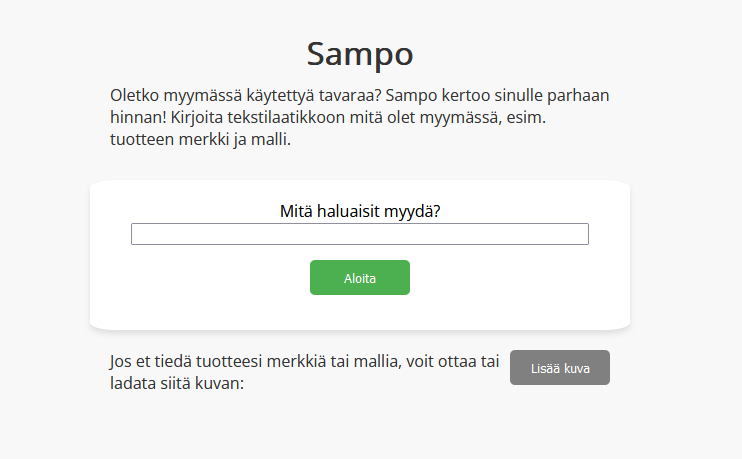
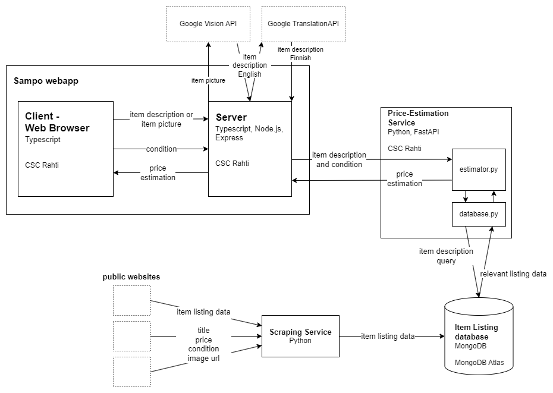
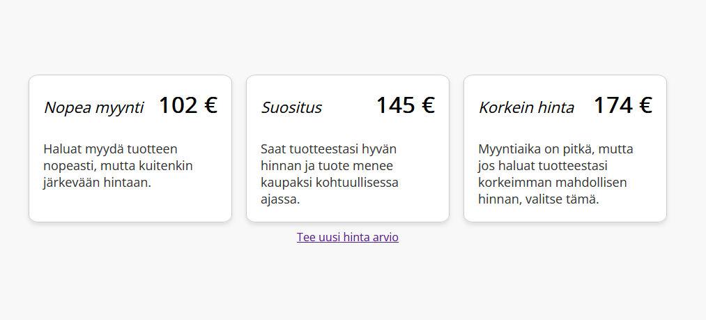

# Sampo

A web application that helps you determine an optimal sale price when selling used items.

[https://sampo.rahtiapp.fi](https://sampo.rahtiapp.fi)

## About the project


The Sampo Web App is as a practical tool to simplify the process of determining the sale price for items users intend to sell online. The app uses data from item listings in some of the most popular Finnish online used item marketplaces. Based on this information, the app provides users with suggestions to assist in setting an optimal price for their listings, whether they aim to sell quickly or get the highest price.

## Built with

The Sampo project consists of three services: the web app in this repository, a scraping service and a price estimation service.

**Sampo Web App**
* Typescript, HTML, CSS
* Node.js
* Express
* Docker

**Scraping Service**, [Github](https://github.com/ohjelmistoprojekti-sampo/Scrape)
* Python

**Price Estimation Service**, [Github](https://github.com/ohjelmistoprojekti-sampo/price-estimation)
* Python
* FastAPI
* Docker

**Database**
* MongoDB

Below is a diagram showing the different parts and services of the application:



## Getting started

Sampo is available at [https//sampo.rahtiapp.fi](https://sampo.rahtiapp.fi/).

For running the project locally follow the instructions below.

### Prerequisites

Before you begin, ensure you have met the following requirements:

  * Node.js installed
  * npm installed
  * A MongoDB database on the cloud or locally
  * [Sampo Price Estimation Service](https://github.com/ohjelmistoprojekti-sampo/price-estimation) installed and running


### Installation

1. Clone the Git-repository to your local machine: 

    ```sh
    git clone https://github.com/ohjelmistoprojekti-sampo/sampo.git
    ```

1. Navigate to your project directory.

2. Install necessary dependencies with npm:

    ```
    npm install
    ```

### Configuration

  1. Add data to your MongoDB database using the [Sampo Scraping Service](https://github.com/ohjelmistoprojekti-sampo/Scrape).
  2. Create an .env file in the project root directory

      ```
      DB_URL = your_url
      DB_NAME = your_db_name
      ITEM_COLLECTION = "item_data"
      DB_PASSWORD = your_password
      DB_USER = your_user
      ```

  3. In index.ts configure the Price Estimation Service URL, for example:
      ```
      const priceEstimationServiceResponse = await fetch(`http://localhost:8000/estimate-price?item_description=${description}&condition=${condition}`);
      ```

### Start the app

Build and start the application:

  ```
  npm run serve
  ```

  The app will start on port 5000 by default

  Visit http://localhost:5000 in your browser to access the app.

## Usage

On the homepage describe your item in the textbox and click "Aloita". If you do not know much about your item you can upload a photo of the item and the app uses image recognition to recognise your product. On mobile browsers you can use the device camera to take a photo of the item.

In the next screen provide the condition of your item.

In the last screen Sampo will provide you three price suggestions for the sale price of your item.



## Known Issues and Limitations

* The app is currently only in Finnish and uses data from Finnish websites.
* The price suggestions do not take into account any item-specific attributes, such as size or color. They are solely based on a single attribute: the condition of the product.
* The dataset used for price estimation is based solely on the titles of the products. It's important to note that the dataset searched from the item description and then used in price estiation may include items that differ greatly from the provided item description resulting in inaccuracy in the price suggestions.
* The fast sell and highest prices are determined by applying a fixed percentage adjustment to the recommended price value so their usefulness is limited. 
* The database of product listing information consists mostly of furniture and home items. So the app can only give suggestions for a really limited set of products.

## Licence

Distributed under the MIT License. See LICENSE.txt for more information.